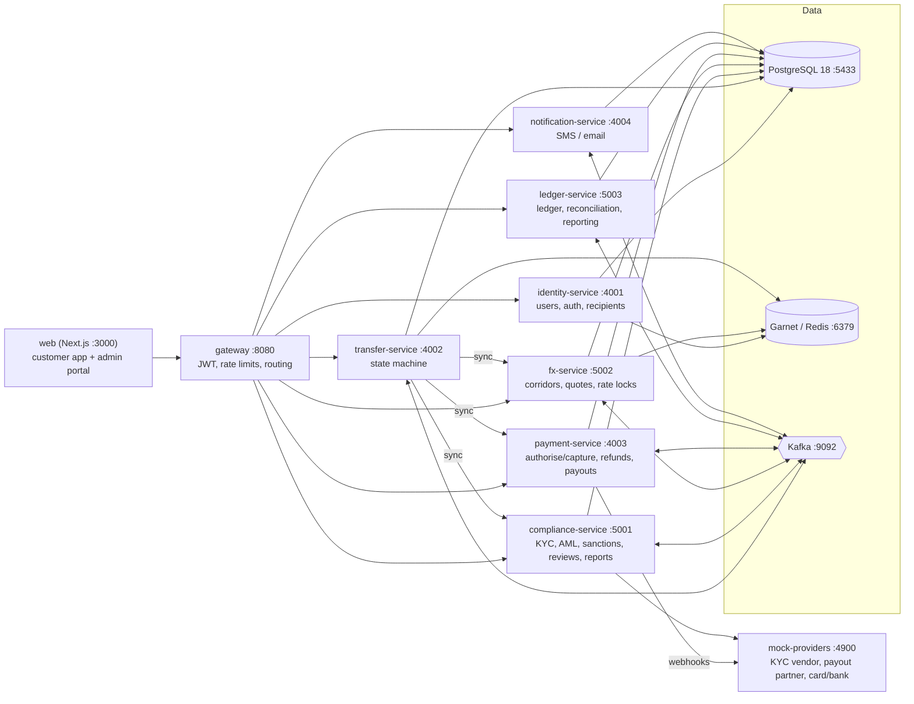
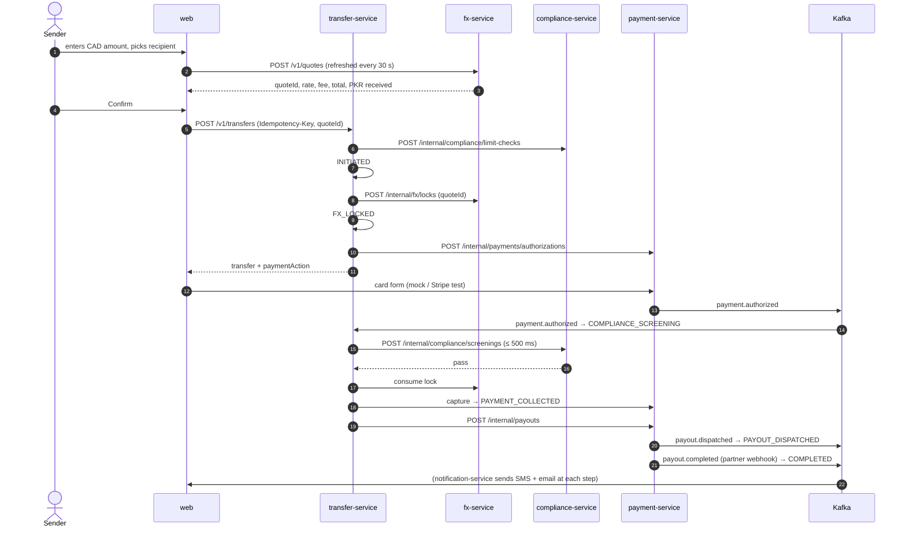

# Architecture

AnchorPay lets people in **Canada** send money to **Pakistan** (and India). Microservices, one per major function,
talk through **synchronous internal HTTP** when the transfer flow must wait for an answer, and **Kafka events**
for everything else. Each service owns its data (one PostgreSQL schema each).

## Services

| Service | Lang | Port | Owns (schema) | Module |
|---|---|---|---|---|
| gateway | Node.js | 8080 | – | 1 (lead) |
| identity-service | Node.js | 4001 | `core` (users, recipients) | 1 |
| transfer-service | Node.js | 4002 | `core` (transfers, history) | 1 |
| compliance-service | Python (FastAPI) | 5001 | `compliance` | 2 |
| fx-service | Python (FastAPI) | 5002 | `fx` | 3 |
| payment-service | Node.js | 4003 | `payments` | 3 |
| ledger-service | Python (FastAPI) | 5003 | `ledger` (+ reads `audit`) | 3 (reporting endpoints: 1) |
| notification-service | Node.js | 4004 | `notify` | 4 |
| web | Next.js + TypeScript + Tailwind | 3000 | – | 4 |
| mock-providers | Node.js | 4900 | – (local files) | shared |

Why these services and not the PDF's full list: [DECISIONS.md D-04](DECISIONS.md#d-04-services).

Until Steps 5–6 are built, `services/stand-ins` answers as **compliance-service (5001)** and **payment-service (4003)**
with in-memory, scripted outcomes, so transfers run end to end today. Each stand-in switches itself off once the real
service exists ([DECISIONS.md D-39](DECISIONS.md#d-39-temporary-stand-ins-for-compliance-service-and-payment-service)).

## Routing
The gateway loads `contracts/openapi/public-api.yaml` at start-up and routes every operation to the service in its
`x-owner-service`, checking `x-roles` against the JWT's `role` claim. The spec is the single source of truth, so
routes can't drift from the contract. `/internal/*` paths are never routed. Services bind to `127.0.0.1` and only
accept internal calls with `X-Internal-Token`.

## A transfer, end to end (happy path)

## Cross-cutting rules
- **Request tracing:** `X-Request-Id` from the gateway is passed on every internal call and stored as the event
  `correlationId`. One id follows a transfer through every log line.
- **Idempotency everywhere:** transfer creation (Idempotency-Key), internal calls (idempotent per transferId),
  consumers (inbox table), webhooks (unique provider event id).
- **No PII outside identity-service:** events and logs carry ids and masked values ([DECISIONS.md D-16](DECISIONS.md#d-16-personal-data-pii)).
- **Timeouts and retries:** internal calls 2 s (screening/payments 5 s); only idempotent calls are retried, with
  exponential backoff. External calls go through circuit breakers.
- **Health:** every service exposes `GET /health`; the gateway's `/health` aggregates them.
