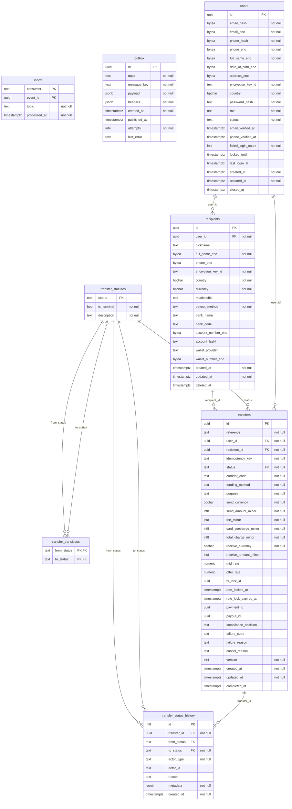
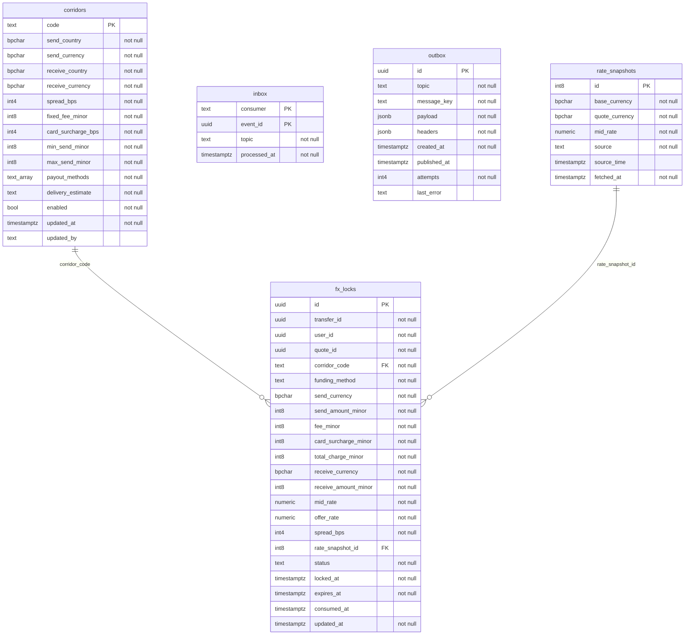
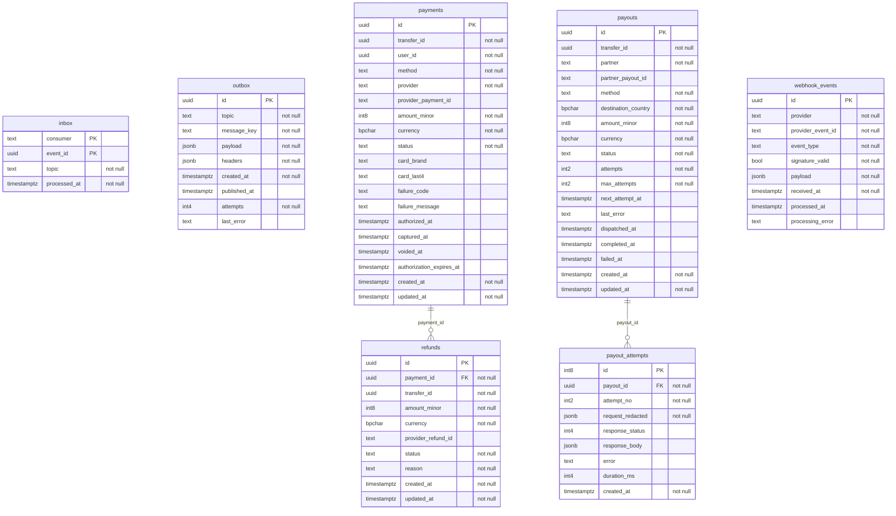
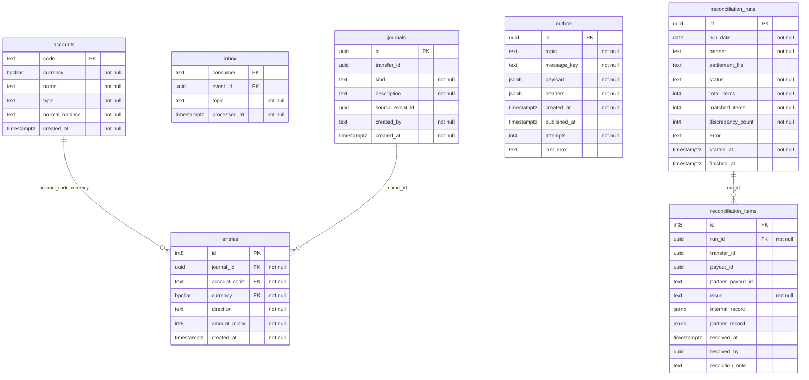
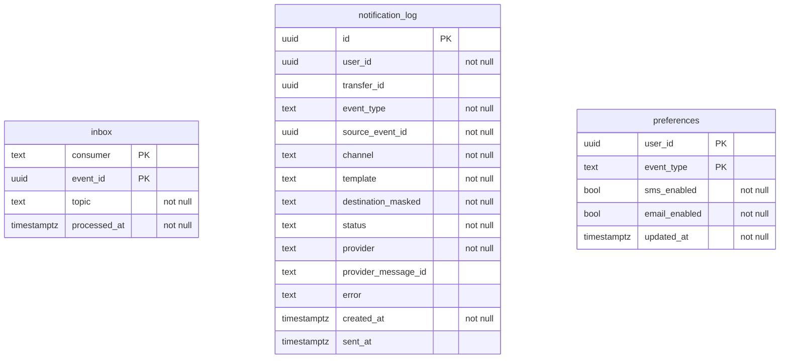
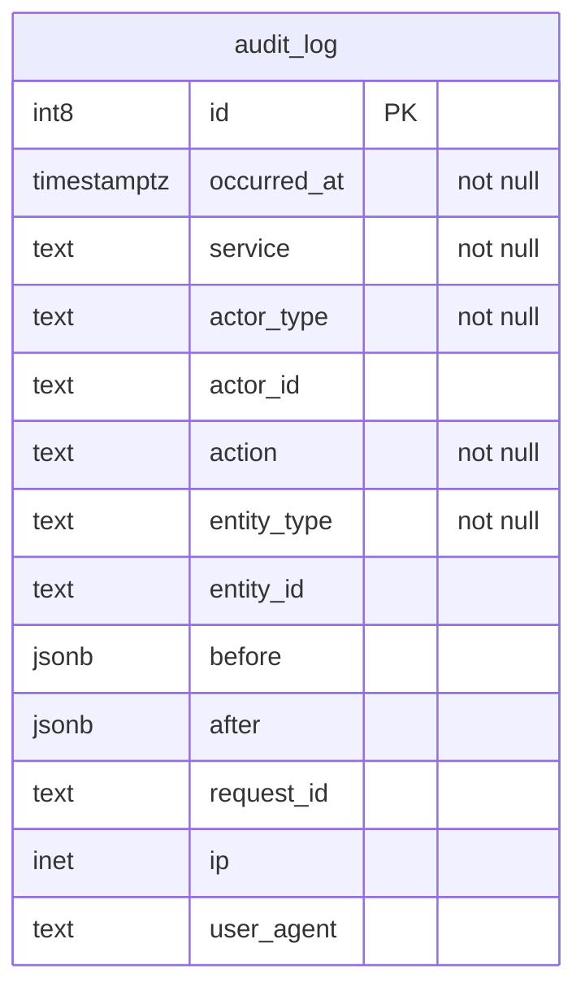

# Database ERD

> Generated by `npm run db:erd` from the live database (8 migrations applied). Do not edit by hand.
>
> Relationships drawn are real foreign keys inside a schema. Ids that point into another service's schema
> (e.g. `payments.payments.transfer_id` → `core.transfers.id`) are deliberately **not** foreign keys: each service owns its data
> and they are linked by id through APIs and events. See [database.md](database.md) for the rules.

## `core` — identity-service + transfer-service (Module 1)

## `compliance` — compliance-service (Module 2)

```mermaid
erDiagram
  aml_rules {
    text code PK
    text description "not null"
    bool enabled "not null"
    text action "not null"
    int2 score_weight "not null"
    jsonb params "not null"
    timestamptz updated_at "not null"
    text updated_by
  }
  compliance_events {
    int8 id PK
    uuid screening_id FK
    uuid transfer_id
    uuid user_id
    text event_type "not null"
    text rule_code
    text result "not null"
    int2 score
    jsonb details "not null"
    text actor_type "not null"
    text actor_id
    timestamptz created_at "not null"
  }
  country_risk {
    bpchar country_code PK
    int2 risk_tier "not null"
    text note
    timestamptz updated_at "not null"
  }
  customer_profiles {
    uuid user_id PK
    int2 kyc_tier FK "not null"
    text kyc_status "not null"
    text risk_rating "not null"
    timestamptz created_at "not null"
    timestamptz updated_at "not null"
  }
  inbox {
    text consumer PK
    uuid event_id PK
    text topic "not null"
    timestamptz processed_at "not null"
  }
  kyc_documents {
    uuid id PK
    uuid kyc_record_id FK "not null"
    text kind "not null"
    text vendor_file_ref "not null"
    timestamptz uploaded_at "not null"
  }
  kyc_records {
    uuid id PK
    uuid user_id "not null"
    int2 tier_requested FK "not null"
    text status "not null"
    text vendor "not null"
    text vendor_reference
    text document_type
    bpchar document_country
    text rejection_reason
    timestamptz submitted_at
    timestamptz decided_at
    text decided_by
    timestamptz created_at "not null"
    timestamptz updated_at "not null"
  }
  kyc_tiers {
    int2 tier PK
    text name "not null"
    text_array requirements "not null"
    bpchar currency "not null"
    int8 per_transfer_limit_minor "not null"
    int8 daily_limit_minor "not null"
    int8 monthly_limit_minor "not null"
    timestamptz updated_at "not null"
    text updated_by
  }
  outbox {
    uuid id PK
    text topic "not null"
    text message_key "not null"
    jsonb payload "not null"
    jsonb headers "not null"
    timestamptz created_at "not null"
    timestamptz published_at
    int4 attempts "not null"
    text last_error
  }
  regulatory_reports {
    uuid id PK
    text report_type "not null"
    uuid transfer_id
    uuid user_id
    text trigger "not null"
    text status "not null"
    jsonb payload "not null"
    text document_path
    timestamptz due_by
    text prepared_by "not null"
    uuid reviewed_by
    timestamptz reviewed_at
    timestamptz filed_at
    text filing_reference
    timestamptz created_at "not null"
    timestamptz updated_at "not null"
  }
  review_cases {
    uuid id PK
    uuid transfer_id "not null"
    uuid user_id "not null"
    uuid screening_id FK "not null"
    text reason "not null"
    text_array rules_triggered "not null"
    int2 fraud_score
    text priority "not null"
    text status "not null"
    uuid assigned_to
    uuid decided_by
    text decision_note
    timestamptz created_at "not null"
    timestamptz updated_at "not null"
    timestamptz decided_at
  }
  risk_thresholds {
    int2 id PK
    int2 auto_approve_below "not null"
    int2 block_at_or_above "not null"
    timestamptz updated_at "not null"
    text updated_by
  }
  sanctions_entries {
    int8 id PK
    uuid list_id FK "not null"
    text source_uid "not null"
    text entity_type "not null"
    text primary_name "not null"
    text_array programs "not null"
    text_array nationalities "not null"
    text_array dates_of_birth "not null"
    text remarks
    jsonb raw
  }
  sanctions_lists {
    uuid id PK
    text source "not null"
    text version "not null"
    text checksum "not null"
    int4 entry_count "not null"
    bool is_active "not null"
    timestamptz loaded_at "not null"
  }
  sanctions_names {
    int8 id PK
    int8 entry_id FK "not null"
    text name "not null"
    text name_normalized "not null"
    bool is_primary "not null"
  }
  screenings {
    uuid id PK
    uuid transfer_id "not null"
    uuid user_id "not null"
    text decision "not null"
    int2 fraud_score "not null"
    text_array rules_triggered "not null"
    bool sanctions_hit "not null"
    int4 duration_ms
    timestamptz created_at "not null"
  }
  screenings ||--o{ compliance_events : "screening_id"
  kyc_tiers ||--o{ customer_profiles : "kyc_tier"
  kyc_records ||--o{ kyc_documents : "kyc_record_id"
  kyc_tiers ||--o{ kyc_records : "tier_requested"
  screenings ||--o{ review_cases : "screening_id"
  sanctions_lists ||--o{ sanctions_entries : "list_id"
  sanctions_entries ||--o{ sanctions_names : "entry_id"
```

## `fx` — fx-service (Module 3)

## `payments` — payment-service (Module 3)

## `ledger` — ledger-service (Module 3)

## `notify` — notification-service (Module 4)

## `audit` — shared — every service inserts, nobody updates

