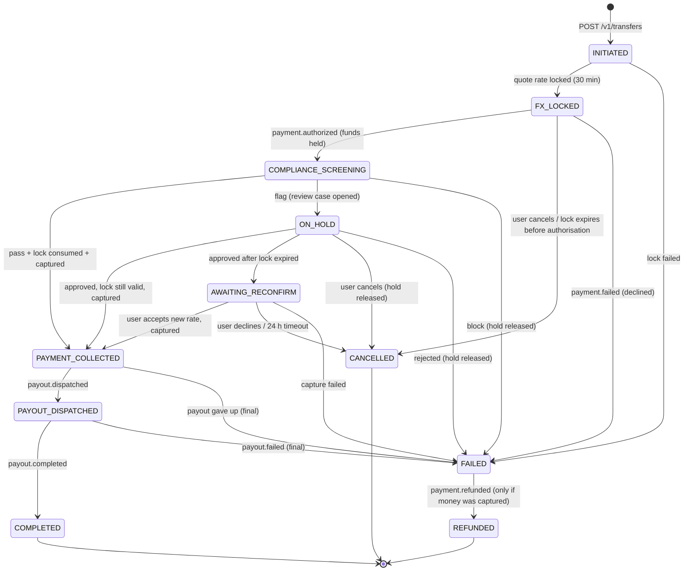

# Transfer state machine

Owned by **transfer-service**. The allowed transitions live in `core.transfer_transitions` and are enforced by a
database trigger: an invalid transition fails even if application code has a bug. Every transition is written to
`core.transfer_status_history` **in the same transaction** as the status change, together with an outbox row for
`transfer.status-changed`. After a crash the service resumes each open transfer from its last saved status.

## States

| Status | Money | Meaning | Customer sees |
|---|---|---|---|
| INITIATED | none | Transfer saved (amount, recipient, corridor, purpose) | "Setting up your transfer" |
| FX_LOCKED | none | Rate locked for 30 min; waiting for the card/bank authorisation | "Confirm your payment" |
| COMPLIANCE_SCREENING | **held** | KYC limits, sanctions, AML rules, fraud score running (≤ 500 ms) | "Checking your transfer" |
| ON_HOLD | held | Flagged; a compliance officer is reviewing | "We're reviewing your transfer" |
| AWAITING_RECONFIRM | held | Approved but the lock expired; the new rate needs the sender's OK | "The rate changed — accept or cancel" |
| PAYMENT_COLLECTED | **captured** | Charged; payout being sent | "Payment received" |
| PAYOUT_DISPATCHED | captured | Payout partner accepted the instruction | "On its way" |
| COMPLETED | delivered | Recipient received the funds | "Delivered" |
| FAILED | depends | A step failed after retries | "Something went wrong" + next steps |
| CANCELLED | released | Stopped before any charge | "Cancelled — you were not charged" |
| REFUNDED | returned | Failed after capture; money returned | "Refunded" + timeline |

## Who triggers each transition

| Transition | Triggered by | How |
|---|---|---|
| → INITIATED | Customer | `POST /v1/transfers` (idempotency key) |
| INITIATED → FX_LOCKED | transfer-service | sync call `POST /internal/fx/locks` |
| FX_LOCKED → COMPLIANCE_SCREENING | payment-service | event `payment.authorized` |
| COMPLIANCE_SCREENING → … | transfer-service | sync call `POST /internal/compliance/screenings`, then `consume` lock + `capture` |
| ON_HOLD → … | Compliance officer | event `compliance.review-decided` |
| AWAITING_RECONFIRM → PAYMENT_COLLECTED | Customer | `POST /v1/transfers/{id}/reconfirm` |
| → CANCELLED | Customer or expiry | `POST /v1/transfers/{id}/cancel`, `fx.lock-expired`, 24 h reconfirm timeout |
| PAYMENT_COLLECTED → PAYOUT_DISPATCHED | payment-service | event `payout.dispatched` |
| PAYOUT_DISPATCHED → COMPLETED | payout partner → payment-service | webhook → event `payout.completed` |
| → FAILED | any step | failure after retries (payout: 3 attempts, then manual queue; `final=true` fails) |
| FAILED → REFUNDED | payment-service | event `payment.refunded` |

## Rules
- A transfer can only be created in `INITIATED`; `version` increments on every status change (optimistic locking:
  `UPDATE … WHERE id = $1 AND version = $2`).
- Never capture before the screening passed **and** the lock was consumed (`/internal/fx/locks/{id}/consume`).
- `FAILED` is terminal unless money was captured; then a refund is started automatically and it ends in `REFUNDED`.
- The CAD amount charged never changes after authorisation. A re-quote only changes the amount the recipient gets.

## How transfer-service runs it
Code: `services/transfer-service/src/domain/workflow.ts` (decisions D-38 to D-42).

- **State changes happen only inside database transactions** (`transition()`: version check, history row, audit row
  and `transfer.status-changed` in one commit). **Calls to other services happen outside them**, and each call is
  idempotent per transfer (lock per transfer + quote, capture/void per payment, refund keyed by the transfer id, one
  payout per transfer). Repeating any step is always safe.
- **Progress markers** record how far a transfer got inside a status: `collect_requested_at` (cleared to charge),
  `payment_captured_at`, `payout_requested_at`, `refund_requested_at`. Money is captured only after the rate lock was
  consumed, and `PAYMENT_COLLECTED` is set only after the capture succeeded.
- **Events** are handled inside the inbox transaction; follow-up calls (screen, capture, pay out, refund) run after it
  commits. Topics are not ordered relative to each other, so `payout.completed` arriving before `payout.dispatched`
  still completes the transfer, and late or duplicate events are ignored.

| Situation | Result |
|---|---|
| Rate can't be locked / payment provider down while creating | `FAILED` (`RATE_LOCK_FAILED` / `PAYMENT_UNAVAILABLE`); the API answers 503; nothing charged |
| `payment.failed` before capture | `FAILED` (`PAYMENT_DECLINED` or `CAPTURE_FAILED`), lock released |
| Screening `block` / review `reject` | `FAILED` (`COMPLIANCE_BLOCKED` / `COMPLIANCE_REJECTED`), hold voided, lock released |
| Screening `flag` | `ON_HOLD` with the review case id |
| Review approved, lock still valid | capture → `PAYMENT_COLLECTED` → payout |
| Review approved, lock expired | `AWAITING_RECONFIRM`; customer calls `requote` then `reconfirm` (same CAD total, new PKR amount) |
| Lock expired before capture (not on hold) | `FAILED` (`RATE_LOCK_EXPIRED`), hold voided |
| `fx.lock-expired` while waiting for the authorisation | `CANCELLED` (`rate_lock_expired`); a late authorisation is voided |
| Capture refused (4xx) / capture service down (5xx) | `FAILED` (`CAPTURE_FAILED`) / left for the recovery job |
| `payout.failed` with `final: true` | `FAILED` (`PAYOUT_FAILED`) → refund started → `payment.refunded` → `REFUNDED` |
| `payout.failed` with `final: false` | stays; the reason is noted (payment-service retries) |
| Customer cancel | only in `FX_LOCKED`, `ON_HOLD`, `AWAITING_RECONFIRM` and **before** the transfer was cleared to charge |

**Recovery job** (every 30 s, transfers unchanged for over a minute) resumes whatever a crash, a missed event or an
outage left behind:

| Status | What it does |
|---|---|
| INITIATED | `FAILED` (`SETUP_INCOMPLETE`): the process stopped between saving and locking |
| FX_LOCKED | lock expired → `CANCELLED`; no payment started after 5 min → `FAILED` (`PAYMENT_NOT_STARTED`) |
| COMPLIANCE_SCREENING | screens again, or continues the capture if it was already cleared |
| ON_HOLD / AWAITING_RECONFIRM | continues a capture that was cleared; an unanswered new rate after 24 h → `CANCELLED` (`reconfirm_timeout`) |
| PAYMENT_COLLECTED | sends the payout request if it never got through |
| FAILED (captured) | starts the refund if it never got through |
