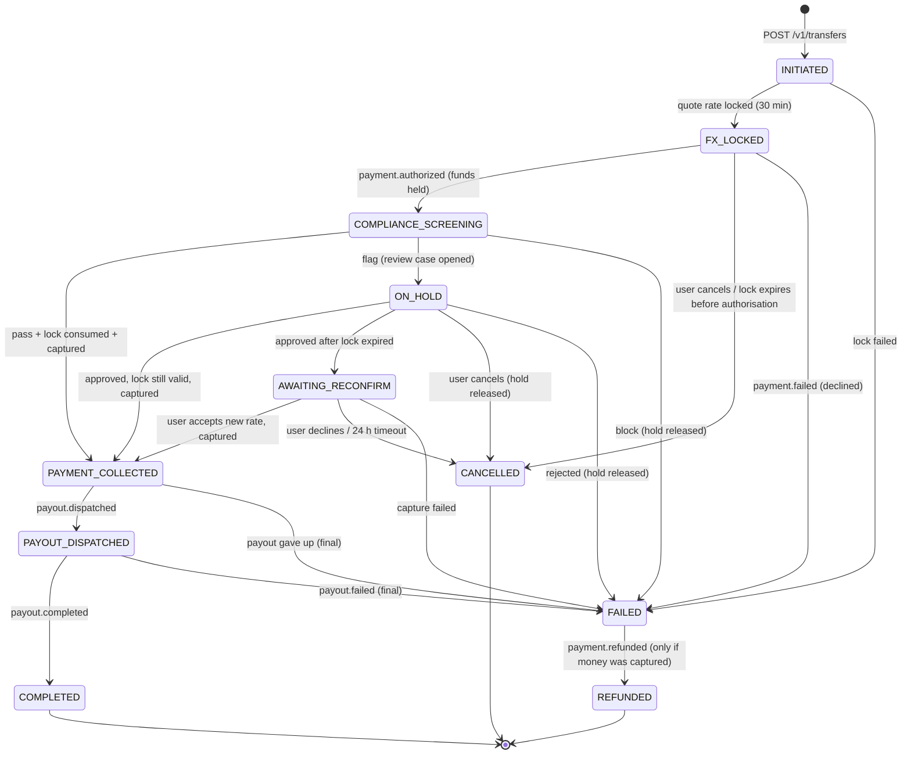

# Transfer state machine

Owned by **transfer-service**. The allowed transitions live in `core.transfer_transitions` and are enforced by a
database trigger: an invalid transition fails even if application code has a bug. Every transition is written to
`core.transfer_status_history` **in the same transaction** as the status change, together with an outbox row for
`transfer.status-changed`. After a crash the service resumes each open transfer from its last saved status.

## States

| Status | Money | Meaning | Customer sees |
|---|---|---|---|
| INITIATED | none | Transfer saved (amount, recipient, corridor, purpose) | "Setting up your transfer" |
| FX_LOCKED | none | Rate locked for 30 min; waiting for the card/bank authorisation | "Confirm your payment" |
| COMPLIANCE_SCREENING | **held** | KYC limits, sanctions, AML rules, fraud score running (≤ 500 ms) | "Checking your transfer" |
| ON_HOLD | held | Flagged; a compliance officer is reviewing | "We're reviewing your transfer" |
| AWAITING_RECONFIRM | held | Approved but the lock expired; the new rate needs the sender's OK | "The rate changed — accept or cancel" |
| PAYMENT_COLLECTED | **captured** | Charged; payout being sent | "Payment received" |
| PAYOUT_DISPATCHED | captured | Payout partner accepted the instruction | "On its way" |
| COMPLETED | delivered | Recipient received the funds | "Delivered" |
| FAILED | depends | A step failed after retries | "Something went wrong" + next steps |
| CANCELLED | released | Stopped before any charge | "Cancelled — you were not charged" |
| REFUNDED | returned | Failed after capture; money returned | "Refunded" + timeline |

## Who triggers each transition

| Transition | Triggered by | How |
|---|---|---|
| → INITIATED | Customer | `POST /v1/transfers` (idempotency key) |
| INITIATED → FX_LOCKED | transfer-service | sync call `POST /internal/fx/locks` |
| FX_LOCKED → COMPLIANCE_SCREENING | payment-service | event `payment.authorized` |
| COMPLIANCE_SCREENING → … | transfer-service | sync call `POST /internal/compliance/screenings`, then `consume` lock + `capture` |
| ON_HOLD → … | Compliance officer | event `compliance.review-decided` |
| AWAITING_RECONFIRM → PAYMENT_COLLECTED | Customer | `POST /v1/transfers/{id}/reconfirm` |
| → CANCELLED | Customer or expiry | `POST /v1/transfers/{id}/cancel`, `fx.lock-expired`, 24 h reconfirm timeout |
| PAYMENT_COLLECTED → PAYOUT_DISPATCHED | payment-service | event `payout.dispatched` |
| PAYOUT_DISPATCHED → COMPLETED | payout partner → payment-service | webhook → event `payout.completed` |
| → FAILED | any step | failure after retries (payout: 3 attempts, then manual queue; `final=true` fails) |
| FAILED → REFUNDED | payment-service | event `payment.refunded` |

## Rules
- A transfer can only be created in `INITIATED`; `version` increments on every status change (optimistic locking:
  `UPDATE … WHERE id = $1 AND version = $2`).
- Never capture before the screening passed **and** the lock was consumed (`/internal/fx/locks/{id}/consume`).
- `FAILED` is terminal unless money was captured; then a refund is started automatically and it ends in `REFUNDED`.
- The CAD amount charged never changes after authorisation. A re-quote only changes the amount the recipient gets.
